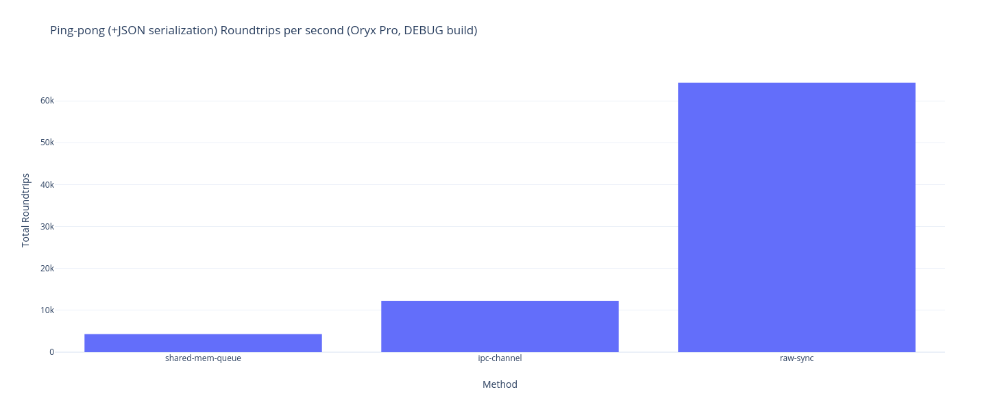
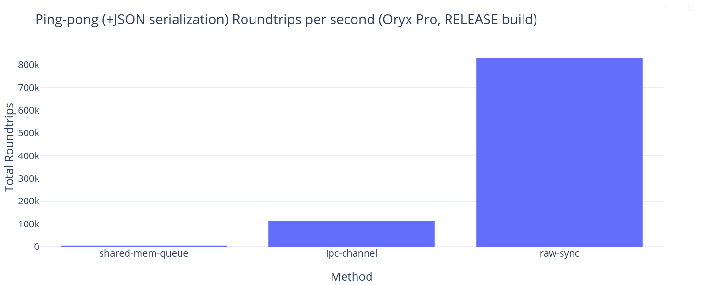
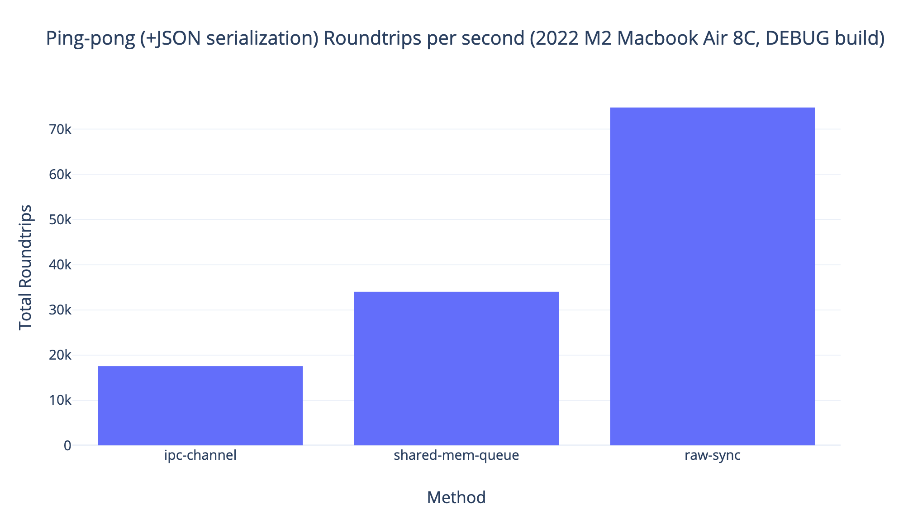
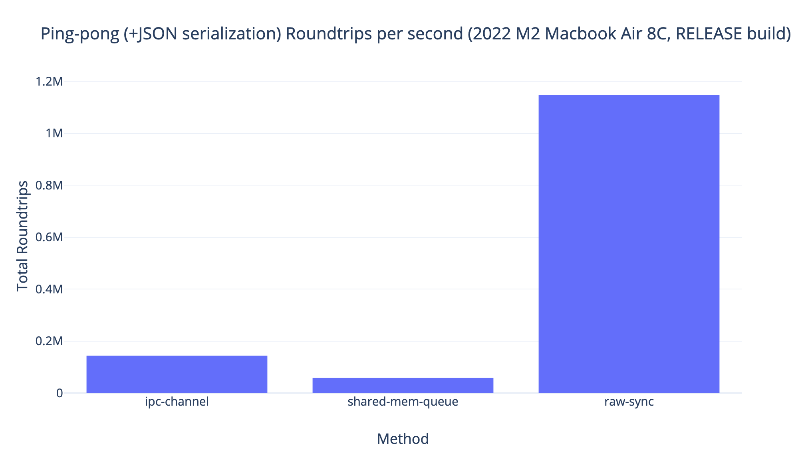

# 🦀 `playground-rust-ipc-experiment`

What's the baseline performance for IPC in [Rust][rust] on your machine? Let's find out.

This Repository was inspired by the following excellent resources built by the community:

- https://3tilley.github.io/posts/simple-ipc-ping-pong/
- https://ekxide.io/blog/iceoryx2-0-4-release/
- https://pranitha.rs/posts/rust-ipc-ping-pong/

While these benchmarks have not been optimized, they represent a *slightly* more realistic workload
than sending `"ping"` and `"pong"`, and include ergonomics to make sending easier along with abstraction
that might be used in a more realistic program than some of the examples above.

The code is far from perfect! If you have a complaint -- file an (politely worded) issue, or even better submit a (graciously written) pull request.

[rust]: https://rust-lang.org

## 📊 Results

For those of us with other things to do today, here are the results on a couple machines.

### On a 2019 Oryx Pro 5 (Intel i7-9750H 12C @ 4.5Ghz)

Average of 3 runs on a *mostly* quiet host, power profile set to "performance".





<details>
<summary><h4>🔢 Raw Data</h4></summary>


### Debug build

| Method                               | Total roundtrips | Average Roundtrips per second per core |
|--------------------------------------|------------------|----------------------------------------|
| `ipc-channel`                        | 122,611          | 12,261.1333                            |
| shared memory via `shared-mem-queue` | 43,171           | 4,317                                  |
| shared memory via `raw-sync`         | 643,182.333      | 64,318.233                             |

### Release build

| Method                               | Total roundtrips | Average Roundtrips per second per core |
|--------------------------------------|------------------|----------------------------------------|
| `ipc-channel`                        | 1,119,410        | 111,941                                |
| shared memory via `shared-mem-queue` | 47,596           | 4,759                                  |
| shared memory via `raw-sync`         | 8,307,083        | 830,708.3                              |


</details>

> [!NOTE]
> Yes, something is wrong with the results for `shared-mem-queue`, I must be holding it wrong somehow.
> No meaningful difference between debug and release is *very very odd*.
>
> That said, that is reflective of DX and is worth including. If it's easy to misuse your library,
> then it's easy to get substandard results.
>
> Probably due to the weird memory requirements that seemed neccessary

### On a 2022 Macbook Air (M2 8C)

Average of 3 runs on a *mostly* quiet host, while plugged in.






<details>
<summary><h4>🔢 Raw Data</h4></summary>


### Debug build

| Method                               | Total roundtrips | Roundtrips per second per core |
|--------------------------------------|------------------|--------------------------------|
| `ipc-channel`                        | 175,545          | 17,554                         |
| shared memory via `shared-mem-queue` | 339,835          | 33,983                         |
| shared memory via `raw-sync`         | 747,685          | 74,768                         |

### Release build

| Method                               | Total roundtrips | Average Roundtrips per second per core |
|--------------------------------------|------------------|----------------------------------------|
| `ipc-channel`                        | 1,431,233        | 143,123                                |
| shared memory via `shared-mem-queue` | 583,071          | 58,307                                 |
| shared memory via `raw-sync`         | 11,474,148.666   | 1,147,414.866                          |

</details>

> [!NOTE]
> Yup, the 8C Macbook Air *was* faster than the 12C (somewhat old) Oryx Pro.
>
> Interestingly enough, shared-mem-queue performs more normally (an improvement over the much more ergonomic `ipc-channel`)
> as expected, with no code-changes.

## 📜 Context

This repository contains a playground project I tinkered with recently which explores high performance [Inter-Process Communication ("IPC")][wiki-ipc] on Rust.

> [!NOTE]
> Playground projects I normally keep private, but useful-seeming ones I make open source in the spirit of
> contributing knowledge back, especially if inspired by learning from others.

Most of the interesting bits aren't necessarily [Rust][rust] related, but rather understanding what is possible at the OS level.

Understanding the edges of what is possible is mostly an exercise in "knowing the platform underneath you". [Unix][wiki-unix]-y OSes
 (Linux, MacOS), Windows, and other operating systems provide disparate sets of tools to programs you write.

Though it's dramatically easier to build them today (compared to maybe a time when there was only one or two very limited platfomrs), this is what makes good cross-platform programs hard. Also, building *performant* cross-platform applications even harder.

IPC can be done in *at least* the following ways, on most major platforms:

- [Shared memory][wiki-shmem] (possibly backed by a file on disk)
- [Pipes/Unix Pipelines][wiki-pipelines] (Possibly [anonymous][wiki-anon-pipes] or [named][wiki-named-pipes])
- TCP/UDP over [Unix Domain Sockets][wiki-uds]
- TCP/UDP w/ [Loopback interfaces][wiki-loopback] (e.g. [`localhost`][wiki-localhost])
- Shared file access

Sound complicated? It is. The specifics of host to properly use this stuff.

That said, **Rust well suited to building cross-platform IPC programs ergonomically and efficiently** -- it has a really easy to use, mostly footgun and toil-free [conditional compilation system][rust-conditional-compilation].

So my contribution to the discussion is to write *slightly* more realistic code that:

- Shows a simple application w/ a parent and child process
- Performs some serialization (JSON)
- Includes some improved ergonomics
- Benchmarks the performance of different solutions against each other (including debug vs release builds)

[wiki-ipc]: https://en.wikipedia.org/wiki/Inter-process_communication
[wiki-unix]: https://en.wikipedia.org/wiki/Unix
[wiki-pipelines]: https://en.wikipedia.org/wiki/Pipeline_(Unix)
[wiki-named-pipes]: https://en.wikipedia.org/wiki/Named_pipe
[wiki-anon-pipes]: https://en.wikipedia.org/wiki/Anonymous_pipe
[rust-conditional-compilation]: https://doc.rust-lang.org/reference/conditional-compilation.html
[wiki-uds]: https://en.wikipedia.org/wiki/Unix_domain_socket
[wiki-loopback]: https://en.wikipedia.org/wiki/Loopback#Virtual_loopback_interface
[wiki-localhost]: https://en.wikipedia.org/wiki/Localhost
[wiki-shmem]: https://en.wikipedia.org/wiki/Shared_memory

## 👟 Run it yourself

### Dependencies

To run the code in here, you'll need the following:

| Dependency         | Description                                               |
|--------------------|-----------------------------------------------------------|
| [`rustup`][rustup] | Installer for Rust toolchain                              |
| [`cargo`][cargo]   | Package manager for Rust (installed by `rustup`)          |
| [`just`][just]     | Task/script runner, alternative to [GNU `make`][gnu-make] |

[just]: https://github.com/casey/just
[rustup]: https://www.rust-lang.org/tools/install
[cargo]: https://doc.rust-lang.org/cargo/
[gnu-make]: https://www.gnu.org/software/make/

### Build

To build the code for this project:

```console
just build
```

> [!NOTE]
> If you want to see all the targets available with `just`, run `just --list`
>
> In this project, the default target is set up such that you can also run `just` with no arguments.

### Run

To run the experiment using [`ipc-channel`][crates-ipc-channel]:

```
just ipc-ipcc
```

You should see output like the following:

```
➜ just ipc-ipcc
    Finished `dev` profile [unoptimized + debuginfo] target(s) in 0.03s
[info] building ipc-benchmarks project

    Finished `dev` profile [unoptimized + debuginfo] target(s) in 0.04s
[info] running IPC testing code (bin/ipcc.rs)
[info] using IPCC_CHILD_BIN_PATH=/home/mrman/code/foss/rust/playground-rust-ipc-experiment/crates/ipc-benchmark/../../target/debug/ipcc-child

    Finished `dev` profile [unoptimized + debuginfo] target(s) in 0.03s
     Running `/home/mrman/code/foss/rust/playground-rust-ipc-experiment/target/debug/ipcc`
completed [119831] ping-pong round-trips [10] seconds ([11983.1] round-trips/second)
```

Similarly, to run the experiment using [`shared-mem-queue`][crates-shared-mem-queue]:

```console
just ipc-shmem-shared-mem-queue
```

For [`raw-sync`][crates-raw-sync], run:

```console
ipc-shmem-raw-sync
```

[crates-ipc-channel]: https://crates.io/crates/ipc-channel
[crates-shared-mem-queue]: https://crates.io/crates/shared-mem-queue
[crates-raw-sync]: https://crates.io/crates/raw-sync

### Benchmark (release mode)

To benchmark in release mode, set the `BUILD_MODE` environment variable to `release`.

If you haven't done this before, the release build will kick off -- but if you *have*, then the binary will be reused and things will just run.

You should see output like this after your fans (if present) are done whirring:

```console
➜ BUILD_MODE=release just ipc-ipcc
    Finished `release` profile [optimized] target(s) in 0.04s
[info] building ipc-benchmarks project

    Finished `release` profile [optimized] target(s) in 0.04s
[info] running IPC testing code (bin/ipcc.rs)
[info] using IPCC_CHILD_BIN_PATH=/home/mrman/code/foss/rust/playground-rust-ipc-experiment/crates/ipc-benchmark/../../target/release/ipcc-child

    Finished `release` profile [optimized] target(s) in 0.04s
     Running `/home/mrman/code/foss/rust/playground-rust-ipc-experiment/target/release/ipcc`
completed [1069466] ping-pong round-trips [10] seconds ([106946.6] round-trips/second)
```

The performance difference

## Contributing

If you see bugs, or want to expand this experiment, please [file an issue][issues] or [submit a PR][prs]!

There's a lot left to be done for this benchmark to be conclusive/a good pointer in the general case. Here are some things you could contribute:

- Fix the absurd memory requirements of the `shared-mem-queue` approach
- JSON output for test (parent) binaries
- Automatic graph generation
- More efficient testing (`divan` once it has JSON output support? `criterion`?)
- TCP (loopback) implementation
- UDP (loopback) implementation
- UDP (domain socket) implementation
- TCP (domain socket) implementation
- TCP (domain socket) implementation
- STDIN/STDOUT only implementation
- QUIC (loopback) implementation
- QUIC (domain socket) implementation
- Multi-core (sync) implementation
- Async implementation

Even if you have ideas -- I'd love to hear them.

[issues]: https://github.com/t3hmrman/playground-rust-ipc-experiment/issues
[prs]: https://github.com/t3hmrman/playground-rust-ipc-experiment/pulls
